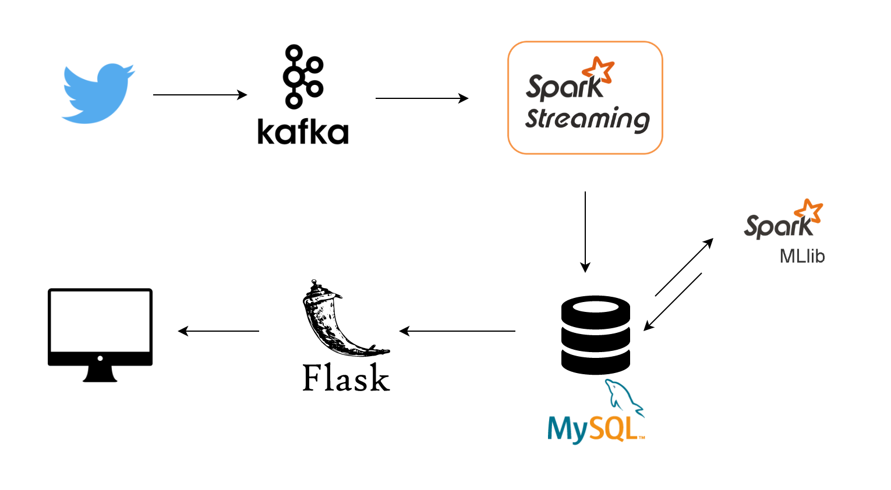

# Insight_DE_Project

## Project Idea:

To analyze and classify the brand reviews based on streaming twitter data.

## Purpose and Use case:

This application provides feedback to business based on user reviews. 

To build an end-to-end data pipeline to analyse the reviews of each brand and to provide some insight about the user views
to the business 

## Technologies:

Twitter API, Kafka, Spark, MySQL, Flask

## Primary Engineering Challenges:
Some of the primary engineering challenges are 
1. latency - the minimum time required to traverse end to end pipeline
2. Stemming and Tokenizing tweets for common brands

## Proposed Architecture:

## Quantitative specifications/constraints
Optimize number of tweets processed per minute.
